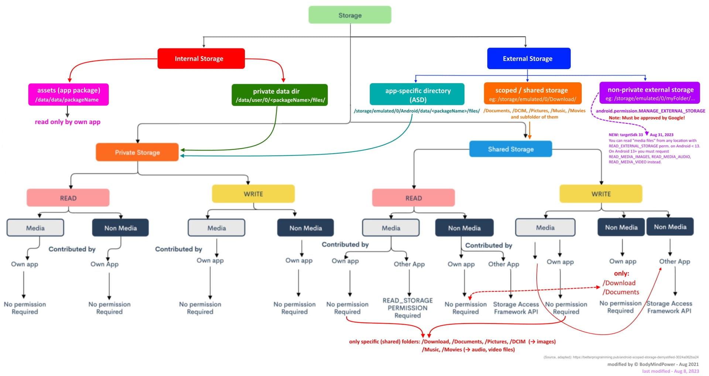

### FileSystem v2  
Попытка запроса полных прав на файлы для Android ниже 11 версии через старый способ (диалоги)
и начиная с 11 версии через Intent  
[Google](https://www.google.com/search?q=How+to+get+ACTION_MANAGE_APP_ALL_FILES_ACCESS_PERMISSION.+Kotlin+Example.&newwindow=1&sca_esv=5cd892c2b13a5520&sxsrf=APpeQnvKUEksEFUb-aeHpLG_dZi_drcSkQ%3A1785912210001&ei=kdtyasbFPNKtwPAP286r0Aw&biw=2048&bih=1018&ved=0ahUKEwiG0oG38YiWAxXSFhAIHVvnCsoQ4dUDCBA&uact=5&oq=How+to+get+ACTION_MANAGE_APP_ALL_FILES_ACCESS_PERMISSION.+Kotlin+Example.&gs_lp=Egxnd3Mtd2l6LXNlcnAiSUhvdyB0byBnZXQgQUNUSU9OX01BTkFHRV9BUFBfQUxMX0ZJTEVTX0FDQ0VTU19QRVJNSVNTSU9OLiBLb3RsaW4gRXhhbXBsZS5ItiVQAFinIHAAeAKQAQCYAVGgAecBqgEBM7gBA8gBAPgBAZgCAaACA8ICBBAAGEeYAwDiAwUSATEgQIgGAZAGCJIHATGgB48CsgcAuAcAwgcDMC4xyAcCgAgB&sclient=gws-wiz-serp)

[stackoverflow](https://stackoverflow.com/questions/65876736/how-do-you-request-manage-external-storage-permission-in-android)

[Some basics on Android storage system](https://community.appinventor.mit.edu/t/some-basics-on-android-storage-system/21556)  
